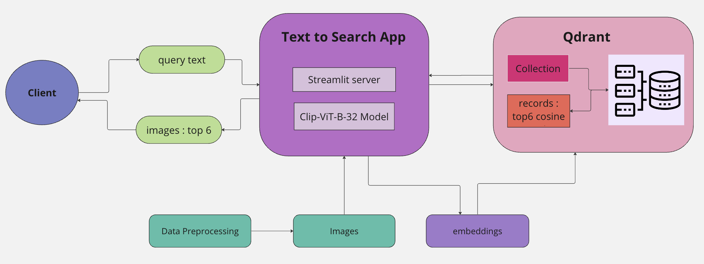
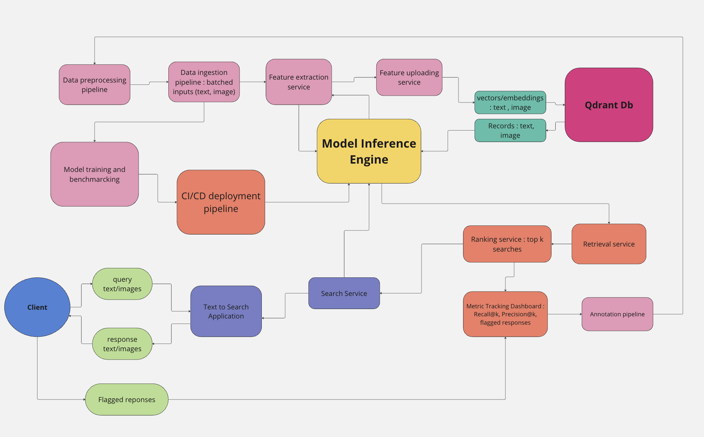

# Text to Image vector search using qdrant

## Data Exploration 

In the following notebook, I explored and cleaned the valid images from the [data](data/images.tsv) created from the open_source dataset. Follow the steps in the notebook : 

[Data Exploration](notebooks/data_exploration.ipynb)

## Start Application : 

Before starting the application, update your api key and cluster url from qdrant cloud app in (qdrant_env)[qdrant.env] file

1. Set up environment :

```
conda create -n text2img python=3.10
pip install -r requirements.txt

```

2. Launch qdrant to upload images and embeddings

```
docker pull qdrant/qdrant
docker run -p 6333:6333 -v $(pwd)/qdrant_storage:/qdrant/storage qdrant/qdrant

```

3. Streamlit application : 

To create and upload embedding vectors in qdrant :

```
streamlit run main_qdrant.py 
```

To Launch text to image search application

```
streamlit run main_app.py 
```

4. Application is now active on :

```
http://localhost:8501/
```


### Query Evaluation

- Provide a set of example queries that effectively showcase the capabilities of your implemented system. These queries should yield relevant images, demonstrating the accuracy and efficiency of your text2image search solution. Here are some of the examples :

    1. For the text "dogs", the results with multiple dogs are ranked higher
    [Dogs](images/dogs.png)

    2. For the text "black car", the top 3 results exactly match a black car
    [Black Car](images/black_car.png)

- Provide examples of queries that do not perform well, accompanied by explanations outlining the shortcomings of the system.

    1. Text sensitive : Examples of images with and without 'a photo of' , as you can see the order of the cats and ranking changes. The reason for this is that the model was trained to align image embeddings with text embeddings of captions containing 'a photo of ' . When I add the text in the app interface, the scores improves :

    [Cat](images/cat.png) 
    [A Photo of Cat](images/a_photo_of_cat.png)

    2. The current scores are cosine similarity scores returned by qdrant. The cosine scoring is low even for the semantically similar text using 'a photo of' . 


## Evaluation measure : 

   - **Precision@K:**
     - Precision at K (P@K) measures the proportion of relevant images in the top K retrieved results. 
   - **Recall@K:**
     - Recall at K (R@K) measures the proportion of relevant images retrieved in the top K results out of all relevant images available for the query.

###  Quantitative evaluation : 

Recall@K measures the proportion of relevant images that appear in the top k results of the query output. It's particularly useful for assessing whether the most relevant images are being searched by the search system. To improve quantitative evaluation it would be useful to work with labelled data and benchmark multiple multimodal models against the dataset to evaluate the performance of the model generating semantic image embeddings/vectors and text vectors. Since the dataset is not labelled, the following steps can be employed to improve the current search.

1. **Dataset Labeling:**
   - **Manual Annotation:**
     - With a team of annotators , manually label the images in the dataset with descriptive text annotations. Each image should have one or more textual descriptions that accurately describe its content.
     - To label the dataset, we can use platforms like Scale AI etc to get the images labelled with the captions describing the contents of the images. 

   - **Automated Annotation:**
     - Using pre-trained image captioning models to generate textual descriptions for each image. These descriptions can be refined or verified manually to ensure accuracy.

    - The dataset then needs to be divided into reference and query set. In general the query set for retrieval should not overlap with the reference set to judge the retrieval performance of the system in real time.

2. **Preparation of Queries:**
   Use the annotated text as queries and create variations for robustness.

   - **Paraphrased Queries:**
     - Create paraphrased versions of the annotations to ensure the model's robustness to variations in query phrasing. For example, "a black cat on a sofa" could be a paraphrase for the previous annotation.

    - Original Annotation: "black cat sitting on a couch"
    - Paraphrased Queries:
        "a black cat on a sofa"
        "cat that is black sitting on the couch"
        "sofa with a black cat sitting"

     [black cat on sofa] (images/black_cat_on_sofa.png)

4. **Fine tune Model** 
    - Choose a better model from [open-clip](https://github.com/mlfoundations/open_clip) and fine tune on the prepared dataset
    - This will help in improving the model on aligning the images with the text better.

5. **Calculate Metrics:**
   - Compute Precision@K, Recall@K for each query and aggregate the results to get an overall performance score on the query set. This chosen model can be used to generate the new vectors to upload in qdrant.


## System Architecture



Here’s a scaled up high-level block diagram for the architecture of a text-to-image search system for real time system :

 

## Challenges

- Making open clip work with the local gpu and current setup, the models are bigger and embedding generation was slow. Hence, I had to resort to clip based model with sentence transformers library.

## Future Improvements

- Use labelled dataset with text/caption information
- Use Open Clip model to upsert text and image vectors to implement Cross modal retrieval system : image to text and text to image retrieval.

## References : 

- https://huggingface.co/sentence-transformers/clip-ViT-B-32
